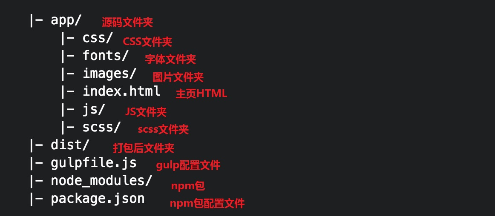

# Gulp #
Gulp笔记

----------

> Gulp 是一个自动化工具，前端开发者可以使用它来处理常见任务：
> 
>    - 搭建web服务器
>    - 文件保存时自动重载浏览器
>    - 使用预处理器如Sass、LESS
>    - 优化资源，比如压缩CSS、JavaScript、压缩图片

- gulp安装
	
		$ npm install gulp -g // 全局安装
		$ npm install --save-dev gulp // 项目本地安装

- gulp项目模板举例：

	

- 初始化一个项目`npm init`

- `gulpfile.js` 新建gulp配置文件

		// 第一步是要获取gulp模块		
		var gulp = require('gulp');

		gulp.task('task-name', function() { // task-name 是给你的任务起的名字，稍后在命令行中执行gulp task-name，将运行该任务
  			return gulp.src('source-files') // 待处理文件
    			.pipe(GulpPlugin()) // 将文件传给gulp插件处理
    			.pipe(gulp.dest('destination')) // 将处理好的文件传出到目标文件夹 
		});

- 使用gulp处理文件时，先要安装相应的gulp插件，记住gulp插件使用步骤`安装 --> 引用 --> 使用`

- 处理sass
	
		var sass = require('gulp-sass');
		// pipe方法是node.js处理流数据的
		gulp.task('sass', function(){
			// gulp首先通过src读取文件产生数据流，然后经过一系列pipe操作，最后通过dest方法将数据流写入文件
  			return gulp.src('app/scss/styles.scss') // 文件入口，这时是处理一个文件，如果要处理多个文件，就使用通配符
    			.pipe(sass()) // 使用gulp-sass插件处理
    			.pipe(gulp.dest('app/css')) // 文件出口
		});

- 通配符匹配模式：

    - `*.scss`：* 号匹配当前目录任意文件，所以这里`*.scss`匹配当前目录下所有scss文件
    - `**/*.scss`： 匹配当前目录及其子目录下的所有scss文件。
    - `!not-me.scss`： ！号移除匹配的文件，这里将移除`not-me.scss`
    - `*.+(scss|sass)`： +号后面会跟着圆括号，里面的元素用|分割，匹配多个选项。这里将匹配scss和sass文件。

			// 改写上面例子
			gulp.task('sass', function() {
  				return gulp.src('app/scss/**/*.scss') // 取得`app/scss/`下所有文件夹的scss文件
    				.pipe(sass())
    				.pipe(gulp.dest('app/css')) // 输出到app/css文件夹，每个scss文件会输出一个CSS文件
					.pipe(browserSync.reload({ // 每次css文件更改都刷新一下浏览器
      					stream: true 
    				}))
			});

- watch监听文件改动`gulp.watch('files-to-watch', ['tasks', 'to', 'run']);`

		gulp.watch('app/scss/**/*.scss', ['sass']); // 监听app/scss文件夹下的scss文件，这是监听一种变化

		// 监听多个文件，将其变为一个监听任务
		gulp.task('watch', function(){
  			gulp.watch('app/scss/**/*.scss', ['sass']);
  			// 其它监听写在下边
		});
	
	执行`gulp watch`命令，每次修改文件，Gulp都将自动为我们执行任务

- Browser Sync帮助我们搭建简单的本地服务器并能实时刷新浏览器，它还能同时刷新多个设备

		var browserSync = require('browser-sync');

		gulp.task('browserSync', function() {
  			browserSync({
    			server: {
      				baseDir: 'app' // 告知根目录位置
    			},
  			});
		});
		
		// 更改监听任务，第二个参数数组是在watch任务之前告知Gulp，先把browserSync和Sass任务执行后再监听变动
		gulp.task('watch', ['browserSync', 'sass'], function (){
  			gulp.watch('app/scss/**/*.scss', ['sass']);
  			// 其它监听写在下边
  			gulp.watch('app/*.html', browserSync.reload); // html文件不需要插件处理，所以直接写监听变化刷新浏览器。但是scss需要先解析为CSS，在刷新浏览器，所以得写在task中
  			gulp.watch('app/js/**/*.js', browserSync.reload);
		});

- 优化CSS和JavaScript文件，压缩，拼接。也就是减少体积和HTTP次数
		
		// gulp-useref会将多个文件拼接成单一文件，并输出到相应目录
		var useref = require('gulp-useref');

		gulp.task('useref', function(){
  			return gulp.src('app/*.html')
        		.pipe(useref())
        		.pipe(gulp.dest('dist'))
		});
		
		// gulp-uglify压缩JS文件
		var uglify = require('gulp-uglify');

		gulp.task('useref', function(){
  			return gulp.src('app/*.html')
    			.pipe(uglify()) // 先执行压缩
    			.pipe(useref()) // 再执行拼接
    			.pipe(gulp.dest('dist'))
		});
		
		// 判断并进行不同的操作
		var gulpIf = require('gulp-if');
		var minifyCSS = require('gulp-minify-css');
		gulp.task('useref', function(){
  			return gulp.src('app/*.html')
    			.pipe(gulpIf('*.css', minifyCSS())) // 判断是CSS文件，压缩CSS文件
    			.pipe(gulpIf('*.js', uglify())) // 判断是JS文件，压缩JS文件
    			.pipe(useref())
    			.pipe(gulp.dest('dist'))
		});

		// 优化图片
		var imagemin = require('gulp-imagemin'); // 压缩图片
		var cache = require('gulp-cache'); // 减少重复压缩

		gulp.task('images', function(){
  			return gulp.src('app/images/**/*.+(png|jpg|gif|svg)')
  				.pipe(imagemin())
				.pipe(cache(imagemin({
      				interlaced: true
    			})))
  				.pipe(gulp.dest('dist/images'))
		});

- 清理生成文件

		var del = require('del');
		// 清理dist所有文件
		gulp.task('clean', function() {
  			del('dist');
		});
		// 不清理images文件夹
		gulp.task('clean:dist', function(callback){
  			del(['dist/**/*', '!dist/images', '!dist/images/**/*'], callback)
		});

- build打包
		
		// Gulp会同时触发[]的事件
		gulp.task('build', [`clean`, `sass`, `useref`, `images`, `fonts`], function (){
	  		console.log('Building files');
		});

		var runSequence = require('run-sequence');
		// 执行task-name时，Gulp会按照顺序执行task-one,task-two,task-thre执行，如果有数组，数组中的会同时执行，再执行后面的
		gulp.task('task-name', function(callback) {
  			runSequence('task-one', 'task-two', ['task1', 'task2'], 'task-three', callback);
		});
		
		// 改进后的代码
		gulp.task('build', function (callback) {
			// 先执行清理再同时执行解析压缩的任务
  			runSequence('clean:dist',['sass', 'useref', 'images', 'fonts'], function () {
				console.log('Building files');
   			})
		});

- 在大型项目中，为了保证维护性，可以写两个文件区分开发环境和生产环境

		// 下面命令行命令可以设置gulp启用设置的gulpfile文件
		gulp --gulpfile gulpfile-dev.js
		gulp --gulpfile gulpfile-build.js