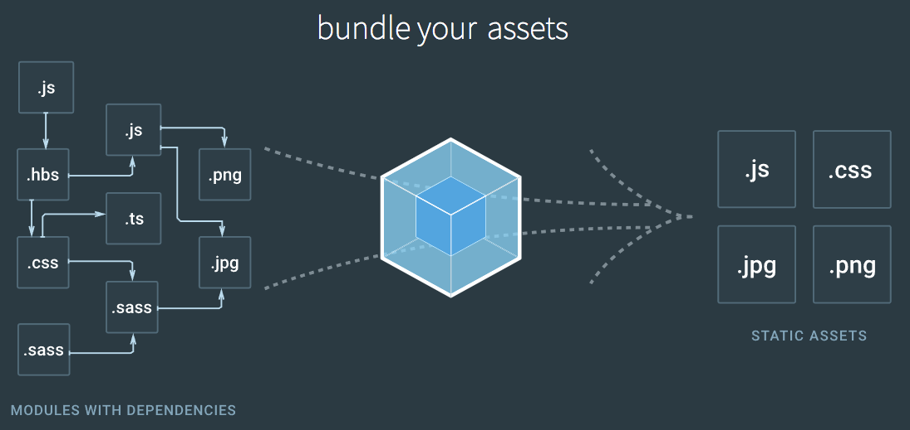

# webpack
webpack笔记

----------

> Webpack 是一个模块打包器。它将根据模块的依赖关系进行静态分析，然后将这些模块按照指定的规则生成对应的符合生产环境部署的前端资源静态资源。
> 
> Webpack 可以将按需加载的模块进行代码分隔，等到实际需要的时候再异步加载
> 
> Webpack 通过 loader 的转换，任何形式的资源都可以视作模块，比如 CommonJs 模块、 AMD 模块、 ES6 模块、CSS、图片、 JSON、Coffeescript、 LESS、 SASS 等

1. webpack安装
		
		$ npm install webpack -g	    //全局环境安装webpack

		// 进入项目目录 项目名建议使用小写字母，并且不带空格，不能含有大写字母

		// 确定已经有 package.json，没有就通过 npm init 创建 

		// 安装 webpack 依赖 

		$ npm install webpack --save-dev    //将 Webpack 安装到项目的依赖中，这样可以使用项目本地版本的 Webpack

2. 在项目中创建package.json文件,npm说明文件，里面蕴含了丰富的信息，包括当前项目的依赖模块，自定义的脚本任务等等

		$ npm init    //创建package.json文件

3. 在项目中安装webpack作为依赖包

		$ npm install webpack --save-dev    //安装webpack到项目

4. Webpack 配置文件其实也是一个简单的 JavaScript 模块，可以把所有与项目构建相关的信息放在里面
		
		module.exports = {
		    entry: __dirname + "/app/main.js", //单个入口文件路径，参数string、object 、array
		    output: {
		        path: __dirname + "/public/", //存放打包后文件的地方路径
		        filename: "bundle.js" //打包后的文件名
		    }
		}
		__dirname 是node.js中的一个全局变量，它指向当前js文件所在的目录

		module.exports = { 
			entry: {            
				app: './src/index.js',   // 多个入口文件，可以给入口文件命名  
				print: './src/print.js' 
			}, 
			output: {        
				filename: '[name].bundle.js', // 按入口命名文件输出出口文件
				path: path.resolve(__dirname, 'dist') 
			} 
		};

5. 编译打包文件

		$ webpack [原始文件] [编译打包之后的文件]    //git命令台编译打包
		//webpack非全局安装的情况
		$ node_modules/.bin/webpack [原始文件] [编译打包之后的文件]

6. Webpack在执行的时候，除了在命令行传入参数，还可以通过指定的配置文件来执行。默认情况下，会搜索当前目录的 webpack.config.js 文件，这个文件是一个 node.js 模块，返回一个 json 格式的配置信息对象，或者通过 --config 选项来指定配置文件，没有就创建一个webpack.config.js.模块加载都可以写在文件中，可以避免每次都在命令行中执行
		
		$ webpack	// webpack全局安装条件下执行
		$ node_modules/.bin/webpack		// webpack项目目录下安装

7.不用命令行，可以利用npm可以引导任务执行，对其进行配置后可以使用简单的`npm start`命令来代替这些繁琐的命令。在package.json中对npm的脚本部分进行相关设置即可
		
		{ 
		"name": "webpack-demo", 
		"version": "1.0.0", 
		"description": "", 
		"scripts": { 
				"start": "webpack", //配置的地方就是这里啦，相当于把npm的start命令指向webpack命令，npm的start是一个特殊的脚本名称，它的特殊性表现在，在命令行中使用npm start就可以执行相关命令，如果对应的此脚本名称不是start，想要在命令行中运行时，需要这样用npm run {script name}如npm run build
				"dev": "webpack-dev-server --devtool eval --progress --content-base build", //配置webpack本地服务器，在终端中执行 npm run dev 命令便可启动本地服务器
				"build": "webpack --progress --profile --colors --config webpack.production.config.js", // 新创建一个单独的config文件，因为部署上线使用webpack的时候我们不需要一些dev-tools,dev-server和jshint校验等
				"watch": "webpack --watch" // 代码改变后重新编译，但观察效果需要刷新浏览器，免刷新是使用webpack-dev-server
			}, 
		"author": "", 
		"license": "ISC", 
		"devDependencies": { 
			"webpack": "^2.2.1" 
			} 
		}

8.使用webpack构建本地服务器
		
		$ npm install webpack-dev-server -g //全局安装 
		$ npm install webpack-dev-server --save-dev // 项目目录安装

> devserver 作为 Webpack 配置选项中的一项，具有以下配置选项:
>	
> - contentBase 默认 webpack-dev-server 会为根文件夹提供本地服务器，如果想为另外一个目录下的文件提供本地服务器，应该在这里设置其所在目录（本例设置到“public"文件夹下）
> 
> - port 设置默认监听端口，如果省略，默认为"8080"

> - inline 设置为 true，当源文件改变时会自动刷新页面

> - historyApiFallback 在开发单页应用时非常有用，它依赖于 HTML5 history API，如果设置为 true，所有的跳转将指向 index.html
		
		// 之后在webpack.config.js中配置
		module.exports = {
  			entry:  __dirname + "/app/main.js",
  			output: {
   				path: __dirname + "/public",
    			filename: "bundle.js"
  			},
			//配置服务器的各个属性
  			devServer: {
				port: 8080, 	//设置默认监听端口，如果省略，默认为”8080“
    			contentBase: "./public",	//本地服务器所加载的页面所在的目录，默认webpack-dev-server会为根文件夹提供本地服务器，如果想为另外一个目录下的文件提供本地服务器，应该在这里设置其所在目录（本例设置到“public"目录）
    			colors: true,	//终端中输出结果为彩色，设置为true，使终端输出的文件为彩色的
    			historyApiFallback: true,	//不跳转，在开发单页应用时非常有用，它依赖于HTML5 history API，如果设置为true，所有的跳转将指向index.html
    			inline: true，	//实时刷新，设置为true，当源文件改变时会自动刷新页面
				hot: true,
  			} 
		}
		
		//配置完成之后运行本地服务器
		$ webpack-dev-server
		//开启服务器并不能自动刷新，要自动刷新要启动热更新
		$ webpack-dev-server --hot --inline

9.webpack 可以使用 loader 来预处理文件。这允许你打包除 JavaScript 之外的任何静态资源.通过使用不同的 loader，Webpack 通过调用外部的脚本或工具可以对任何静态资源进行处理，比如说分析 JSON 文件并把它转换为 JavaScript 文件，或者说把 ES6 / ES7 的 JS 文件转换为现代浏览器可以识别的 JS 文件.对 React 开发而言，合适的 Loaders 可以把 React 的 JSX 文件转换为 JS 文件。Loaders需要单独安装并且需要在webpack.config.js下的`modules`关键字下进行配置，Loaders的配置选项包括以下几方面：

> Loaders 需要单独安装并且需要 在webpack.config.js 下的 modules 关键字下进行配置，Loaders 的配置选项包括以下几方面：
>
    test：一个匹配 Loaders 所处理的文件的拓展名的正则表达式（必须）
    loader或者use：loader 的名称（必须），参数是数组，注意loaders的处理顺序是从右到左的
    include/exclude: 手动添加必须处理的文件/文件夹,或屏蔽不需要处理的文件/文件夹（可选）
    query：为 Loaders 提供额外的设置选项（可选）
	
	//安装可以装换JSON的loader
	$ npm install --save-dev json-loader

	//配置文件webpack.config.js中配置loader
	module.exports = {   
		devtool: 'eval-source-map',   
		entry: __dirname + "/app/main.js",   
		output: {     
			path: __dirname + "/public",     
			filename: "bundle.js" 
		},   
		module: {//在配置文件里添加JSON loader     
			loaders: [ 
				{         
					test: /\.json$/,         
					loader: "json-loader" 
				},
				{ 
					test: /\.css$/, 
					loaders: ['style-loader', 'css-loader'], 
					include: /pulic/,
					exclude: /node_modules/ //编译打包时需要排除 node_modules 文件夹
				}	 
			] 
		}
	}
	* 注意JSON文件里面不可以有注释

10. Source Maps 就是一个信息文件，里面储存着位置信息。也就是说，转换后的代码的每一个位置，所对应的转换前的位置.有了它，出错的时候，除错工具将直接显示原始代码，而不是转换后的代码。这无疑给开发者带来了很大方便.为了方便调试可以利用 Webpack 生成 Source Maps.

> Webpack 的配置文件中配置 Source Maps，需要配置 devtool，它有以下四种不同的配置选项，各有优缺点:
> 
> - source-map 在一个单独的文件中产生一个完整且功能完全的文件。这个文件具有最方便调试的 Source Maps，但是这个文件会比较大,会减慢打包文件的构建速度
> - cheap-module-source-map 在一个单独的文件中生成一个不带列映射的 Source Maps，不带列映射能够提高项目构建速度，但这也使得浏览器开发者工具只能对应到具体的行，不能对应到具体的列，会对调试造成不便
> - eval-source-map 在同一个文件中生成干净的完整的 Source Maps。这个选项可以在不影响构建速度的前提下生成完整的 Source Maps，但是对打包后输出的 js 文件的执行具有性能和安全的隐患。不过在开发阶段这是一个非常好的选项，但是在生产阶段一定不要用这个选项
> - cheap-module-eval-source-map 这是在打包文件时最快的生成 Source Maps 的方法，生成的Source Map 会和打包后的 js 文件同行显示，没有列映射，和 eval-source-map 选项具有相似的缺点,文件的执行具有性能和安全的隐患
>
		module.exports = {
		    devtool: "source-map", //配置生成 Source Maps 的选项
		    entry: __dirname + "/app/main.js", //入口文件路径
		    output: {
		        path: __dirname + "/public/", //存放打包后文件的地方路径
		        filename: "bundle.js" //打包后的文件名
		    }
		}

11. Webpack 提供两个工具处理样式表，css-loader 和 style-loader.

> css-loader 使你能够使用类似 @import 和 url(...) 的方法实现 require() 的功能
> 
> style-loader 将所有的计算后的样式加入页面中
> 
> CSS modules 的技术就能够把 JS 的模块化思想带入 CSS 中来，通过 CSS 模块，所有的类名，动画名默认都只作用于当前模块,Webpack 从一开始就对 CSS 模块化提供了支持，在 CSS loader 中进行配置后，你所需要做的一切就是把 modules 传递到需要的地方，然后就可以直接把 CSS 的类名传递到组件的代码中，且这样做只对当前组件有效，不必担心在不同的模块中具有相同的类名可能会造成的问题
>
	//配置文件webpack.config.js中配置loader
	module.exports = {   
		devtool: 'eval-source-map',   
		entry: __dirname + "/app/main.js",   
		output: {     
			path: __dirname + "/public",     
			filename: "bundle.js" 
		},   
		module: {//在配置文件里添加JSON loader     
			loaders: [ 
				{         
					test: /\.json$/,         
					loader: "json-loader" 
				},
				{
            		test: /\.css$/,
            		loader: 'style-loader!css-loader?modules' ///添加对样式表的处理,感叹号的作用在于使同一文件能够使用不同类型的 loader，添加?modules是CSS模块化
        		}	 
			] 
		}
	}

12. Babel 其实是一个编译 JavaScript 的平台，它的强大之处表现在可以通过编译帮你达到以下目的：

> - 把 ES6 / ES7 标准的 JavaScript 转化为浏览器能够解析的 ES5 标准的 JavaScript.   
> - 使用基于 JavaScript 进行了拓展的语言，比如 React 的 JSX.

13. CSS预处理器，CSS 预处理器可以将 SASS、LESS 文件转化为浏览器可识别的 CSS 文件,以下是常用的CSS 预处理器 `loaders.Less Loader，Sass Loader，Stylus Loader`

14. 插件：

	- HtmlWebpackPlugin，更改了我们的一个入口起点的名称，甚至添加了一个新的名称，生成的包将被重命名在一个构建中，但是我们的index.html文件仍然会引用旧的名字。我们用 HtmlWebpackPlugin 来解决这个问题
	
	- clean-webpack-plugin，是一个比较普及的管理插件，会清除过去的指南和代码示例
		
			const path = require('path'); 
			const HtmlWebpackPlugin = require('html-webpack-plugin'); 
			const CleanWebpackPlugin = require('clean-webpack-plugin'); 
			module.exports = { 
				entry: { 
					app: './src/index.js', 
					print: './src/print.js' }, 
				plugins: [     
					new CleanWebpackPlugin(['dist']), 
					new HtmlWebpackPlugin({ 
						title: 'Output Management' }) 
				], 
				output: { 
					filename: '[name].bundle.js', 
					path: path.resolve(__dirname, 'dist') 
				} 
			};

15. 模块热替换(Hot Module Replacement 或 HMR)是 webpack 提供的最有用的功能之一。它允许在运行时更新各种模块，而无需进行完全刷新